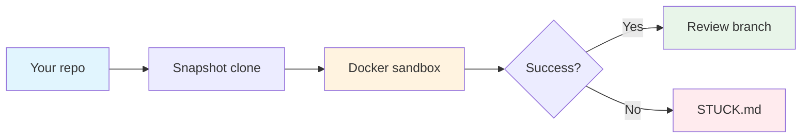

# Forklift

Keep your fork fresh with AI-powered rebasing.

Forklift runs an AI agent in an isolated container to rebase your fork against upstream, then hands you a local branch to review. If it gets stuck, it writes a `STUCK.md` explaining what blocked progress.

## Quick Start

```bash
# Build the container (once)
docker build -t forklift/kitchen-sink:latest docker/kitchen-sink

# Configure OpenCode credentials
cp ~/.config/forklift/opencode.env.example ~/.config/forklift/opencode.env
# Edit opencode.env with your API keys and settings

# Run in your fork
cd your-fork-repo
uv run forklift --debug
```

## Prerequisites

- Git repo with `origin` (your fork) and `upstream` (source) remotes
- [Docker](https://docs.docker.com/get-started/)
- [uv](https://docs.astral.sh/uv/) (`pip install uv`)
- [git-filter-repo](https://github.com/newren/git-filter-repo) 2.47.0+ (`pip install git-filter-repo==2.47.0` or `brew install git-filter-repo`)
- Git identity configured (`git config user.name` / `git config user.email`)

## Usage

### Basic run

```bash
uv run forklift --debug
uv run forklift --version
```

### Options

| Flag | Description |
|------|-------------|
| `--main-branch=<name>` | Target branch if not `main` |
| `--target-policy=tip` | Rebase to upstream branch tip (default) |
| `--target-policy=latest-version` | Rebase to latest stable tag (`X.Y.Z` or `vX.Y.Z`) |
| `--timeout-seconds=<n>` | Override agent timeout (default: 600) |
| `--model`, `--variant`, `--agent` | Override OpenCode settings per-run |

### Changelog preflight

Preview what's changed upstream before running the full sync:

```bash
uv run forklift changelog
uv run forklift changelog --main-branch=dev
```

This runs entirely on the host with no container launch or history mutation. Requires Git 2.38+.

## Configuration

Create `~/.config/forklift/opencode.env` (mode `0600`):

```
OPENCODE_API_KEY=sk-...
OPENCODE_VARIANT=production
OPENCODE_AGENT=default-agent
OPENCODE_SERVER_PASSWORD=server-passphrase

# Optional
OPENCODE_ORG=acme
OPENCODE_MODEL=claude-35-sonnet
OPENCODE_TIMEOUT=600
OPENCODE_SERVER_PORT=4096

# Provider keys (at least one required)
ANTHROPIC_API_KEY=...
OPENAI_API_KEY=...
GOOGLE_GENERATIVE_AI_API_KEY=...
OPENROUTER_API_KEY=...
```

### Environment overrides

| Variable | Description |
|----------|-------------|
| `FORKLIFT_DOCKER_IMAGE` | Alternate container image |
| `FORKLIFT_DOCKER_ARGS` | Extra `docker run` flags (GPU, proxies, etc.) |
| `DOCKER_BIN` | Override Docker CLI path |

## FORK.md

Add a `FORK.md` to your repo root to give the agent context about your fork. See the [template](FORK.md) for format and examples.

## Outputs

Run artifacts are stored in `~/.local/state/forklift/runs/<project>_<timestamp>/`:

| Path | Description |
|------|-------------|
| `workspace/` | Cloned repo where the agent worked |
| `workspace/STUCK.md` | Written if the agent couldn't complete |
| `harness-state/opencode-client.log` | Agent transcript |
| `harness-state/opencode-server.log` | Server bootstrap log |
| `harness-state/setup.log` | FORK.md setup command output |
| `opencode-logs/` | Full OpenCode debug traces |

On success, Forklift publishes a review branch: `upstream-merge/<timestamp>/<branch>`.

Run directories older than 7 days are automatically pruned.

## How it works



1. Fetches `origin` and `upstream`, checks if sync is needed
2. Creates isolated workspace clone (remotes stripped)
3. Launches container with AI agent
4. Agent rebases onto upstream target
5. Success: rewrites commits to your identity, publishes `upstream-merge/...` branch
6. Failure: writes `STUCK.md` for inspection

## Development

```bash
uv run basedpyright                                    # Type checking
docker build -t forklift/kitchen-sink:latest docker/kitchen-sink  # Rebuild container
```
