```mermaid
flowchart TD
  subgraph S1["1. Create command skeleton and wire CLI entrypoints"]
    t11["1.1 Create changelog command class"]
    t12["1.2 Wire changelog subcommand in cli.py"]
    t13["1.3 Add placeholder markdown smoke implementation"]
    t14["1.4 Add parsing test for forklift changelog"]
  end

  subgraph S2["2. Add strongly typed changelog data models"]
    t21["2.1 Create changelog_models dataclasses"]
    t22["2.2 Ensure model fields match design contract"]
    t23["2.3 Add dataclass construction/type tests"]
  end

  subgraph S3["3. Implement deterministic git analysis helpers"]
    t31["3.1 Create changelog_analysis and resolve refs helper"]
    t32["3.2 Reuse ensure_required_remotes and fetch_remotes"]
    t33["3.3 Add Git >=2.38 version gate"]
    t34["3.4 Add merge-base helper"]
    t35["3.5 Add merge-tree --write-tree helper with status capture"]
    t36["3.6 Parse Conflicted file info into ConflictHotspot"]
    t37["3.7 Implement merge-tree exit handling (0/1/>1)"]
    t38["3.8 Add deterministic diff-stat helpers"]
    t39["3.9 Build bounded EvidenceBundle"]
  end

  subgraph S4["4. Implement LLM narrative generation with hard-fail behavior"]
    t41["4.1 Create changelog_llm public narrative function"]
    t42["4.2 Build prompt from bounded deterministic evidence"]
    t43["4.3 Integrate env/model loading"]
    t44["4.4 Raise typed errors for model failures"]
    t45["4.5 Convert LLM failures to non-zero command exit"]
    t46["4.6 Use stable pydantic-ai run APIs only"]
  end

  subgraph S5["5. Implement markdown output renderer"]
    t51["5.1 Create changelog_renderer section assembler"]
    t52["5.2 Include required output sections"]
    t53["5.3 Include hotspot caveat text"]
    t54["5.4 Render markdown via Rich"]
  end

  subgraph S6["6. Integrate full changelog command flow"]
    t61["6.1 Replace placeholder with full orchestration flow"]
    t62["6.2 Enforce read-only non-orchestration behavior"]
    t63["6.3 Require deterministic + LLM success for zero exit"]
    t64["6.4 Return non-zero on remote/git/LLM failures"]
    t65["6.5 Add single intent doc comment and uniqueness check"]
  end

  subgraph S7["7. Add comprehensive tests"]
    t71["7.1 Unit test merge-tree parser scenarios"]
    t72["7.2 Unit test merge-tree exit semantics"]
    t73["7.3 Unit test diff-stat parsing"]
    t74["7.4 Unit test evidence truncation"]
    t75["7.5 Integration test success path"]
    t76["7.6 Integration test LLM failure path"]
    t77["7.7 Integration test non-orchestration guardrail"]
  end

  subgraph S8["8. Update user documentation and run verification"]
    t81["8.1 Update README usage examples"]
    t82["8.2 Document host-side/no-container behavior"]
    t83["8.3 Document Git 2.38+ requirement"]
    t84["8.4 Document hotspot caveat"]
    t85["8.5 Run targeted tests and record results"]
  end

  t11 --> t12
  t11 --> t13
  t12 --> t14

  t21 --> t22
  t22 --> t23

  t31 --> t32
  t31 --> t33
  t31 --> t34
  t31 --> t35
  t35 --> t36
  t21 --> t36
  t35 --> t37
  t36 --> t37
  t31 --> t38
  t34 --> t39
  t37 --> t39
  t38 --> t39
  t22 --> t39

  t21 --> t41
  t41 --> t42
  t39 --> t42
  t41 --> t43
  t41 --> t44
  t43 --> t45
  t44 --> t45
  t41 --> t46

  t51 --> t52
  t52 --> t53
  t53 --> t54

  t13 --> t61
  t39 --> t61
  t42 --> t61
  t43 --> t61
  t46 --> t61
  t54 --> t61
  t61 --> t62
  t61 --> t63
  t61 --> t64
  t45 --> t64
  t61 --> t65

  t36 --> t71
  t37 --> t72
  t38 --> t73
  t39 --> t74
  t63 --> t75
  t64 --> t76
  t62 --> t77

  t61 --> t81
  t62 --> t82
  t33 --> t83
  t53 --> t84

  t71 --> t85
  t72 --> t85
  t73 --> t85
  t74 --> t85
  t75 --> t85
  t76 --> t85
  t77 --> t85
```

## Existing path sets by grouping (reverse editing order, new files omitted)

### S1 - Create command skeleton and wire CLI entrypoints
- `src/forklift/cli.py`

### S2 - Add strongly typed changelog data models
- none (all previously listed paths for this grouping are new)

### S3 - Implement deterministic git analysis helpers
- `src/forklift/git.py`

### S4 - Implement LLM narrative generation with hard-fail behavior
- `src/forklift/cli_runtime.py`
- `src/forklift/opencode_env.py`
- `pyproject.toml`

### S5 - Implement markdown output renderer
- `src/forklift/post_run_metrics.py`

### S6 - Integrate full changelog command flow
- `src/forklift/cli.py`
- `src/forklift/run_manager.py`
- `src/forklift/container_runner.py`
- `src/forklift/cli_post_run.py`
- `src/forklift/cli_authorship.py`

### S7 - Add comprehensive tests
- none (all previously listed paths for this grouping are new)

### S8 - Update user documentation and run verification
- `README.md`
- `openspec/changes/add-changelog-command/specs/changelog-command/spec.md`
- `openspec/changes/add-changelog-command/design.md`
- `openspec/changes/add-changelog-command/tasks.md`
