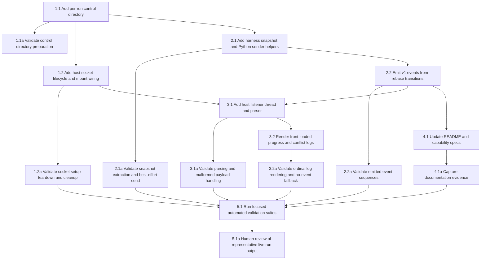

## 1. Run control path and socket lifecycle
- [x] 1.1 Extend `src/forklift/run_manager.py` `RunPaths` plus `RunDirectoryManager.prepare()` to create a per-run `control/` directory, include it in returned run paths, and align its ownership/permissions with the other container-mounted run artifacts.
- [x] 1.1a Add/update `tests/test_run_manager.py` — which currently focuses on fork-context overlay cases — to prove `prepare()` now creates the control directory, returns it in `RunPaths`, and leaves it writable for the container user.
- [x] 1.2 Update `src/forklift/container_runner.py` to create a host-side Unix domain listener socket inside `control/`, reject overlength Linux pathname sockets before bind, remove stale socket paths before bind, mount the control directory into the container, export `FORKLIFT_REBASE_EVENTS_SOCK`, and tear the listener down cleanly after the container exits or times out.
- [x] 1.2a Add/update `tests/test_container_runner_run_state.py` — which currently covers run-state transitions and `_force_stop()` — to cover socket setup/teardown, overlength-path early failure, control mount/env wiring, and timeout cleanup behavior.

## 2. Harness event snapshotting and emission
- [x] 2.1 Extend `docker/kitchen-sink/harness/run.sh` and `docker/kitchen-sink/harness/includes/rebase.sh` with helpers that no-op when `FORKLIFT_REBASE_EVENTS_SOCK` is absent, derive normalized rebase progress snapshots from both `rebase-merge` and `rebase-apply`, and send one newline-delimited JSON event per call via Python.
- [x] 2.1a Add/update `tests/test_harness_setup.py` — already the main harness rebase suite — to prove snapshot extraction returns correct `step`, `total`, `sha`, `subject`, and conflicted files for both rebase backends, and that missing/unreachable socket configuration does not fail the rebase.
- [x] 2.2 Emit structured v1 events from all harness-owned transitions: initial paused conflict, `git rebase --continue`, repeated paused conflicts after continue, explicit skip, mechanical auto-skip, clean completion, and allowed abort after `STUCK.md`.
- [x] 2.2a Add/update `tests/test_harness_setup.py` to capture emitted event sequences for conflict, continue-to-conflict, explicit skip, the existing implicit auto-skip branch, and abort flows.

## 3. Host event parsing and top-level logging
- [x] 3.1 Add a dedicated listener thread and event parser in `src/forklift/container_runner.py` that accepts short-lived socket connections, parses v1 payloads, warns on malformed/unknown payloads, and forwards valid events into structured top-level logging without changing existing stdout/stderr capture.
- [x] 3.1a Add/update `tests/test_container_runner_run_state.py` to cover valid event parsing, malformed JSON warnings, unknown event/version handling, and listener shutdown without hanging `process.communicate()`.
- [x] 3.2 Wire parsed events into `src/forklift/cli.py` log rendering so progress and conflict messages are visually front-loaded (`Rebase 5/31`, `Conflict 5/31`) while preserving structured `step`, `total`, `sha`, `subject`, and conflict file metadata.
- [x] 3.2a Add/update `tests/test_cli_runtime.py` — which currently focuses on runtime/footer logging behavior — to prove emitted log lines include the ordinal in the event text plus the structured fields, and that the feature degrades cleanly when no events arrive.

## 4. Documentation and capability specs
- [x] 4.1 Update `README.md` and the affected OpenSpec capability docs to describe live top-level rebase progress/conflict reporting, the dedicated cross-container event channel, and the fact that stdout/stderr and `opencode-client.log` remain separate surfaces.
- [x] 4.1a Capture doc diffs or rendered excerpts proving the operator-facing docs and capability specs describe the new behavior consistently.

## 5. Focused validation
- [x] 5.1 Run the targeted automated suites touched by this feature, specifically `tests/test_run_manager.py`, `tests/test_container_runner_run_state.py`, `tests/test_cli_runtime.py`, and `tests/test_harness_setup.py`, and archive the command outputs as implementation evidence.
- [ ] 5.1a (HUMAN_REQUIRED) Review a representative `forklift` run excerpt showing a live `Rebase N/Total` message, a live `Conflict N/Total` message with file details, and continued successful completion after the structured events are emitted.

