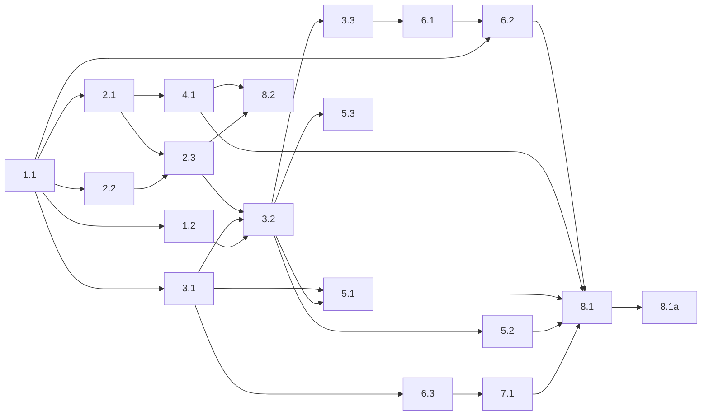

# Tasks: custom-harness

Flat checklist below; the mermaid graph at the end is the authoritative
sequencing/parallelism contract.

## 1. Foundation: dependencies

- [x] 1.1 Resolve the BLOCKING `pydantic-ai-harness` ↔ `pydantic-ai==1.99.0` version conflict. RESOLVED via option (a) with a correction: PyPI `pydantic-ai-harness==0.3.0` (latest release) ships **only `CodeMode`** — `Shell`/`ShellToolset`/`FileSystem` exist solely on GitHub `main` (open PR #177, requires `pydantic-ai-slim>=1.105.0`). Kept the verified `pydantic-ai==1.99.0` pin and `uv add`ed `pydantic-ai-harness[code-mode]==0.3.0` + `bashlex`; the shell-exec/file tools Decision 2 expected from the harness are home-rolled inside our toolset (task 2.3). `genai-prices` already satisfies.
- [x] 1.1a Verify: `uv lock` resolves with no version conflict, and a throwaway import of `pydantic_ai_harness.CodeMode` (the released capability), `pydantic_ai.capabilities`, and `bashlex` runs clean; capture output.
- [x] 1.2 Implement the conflict-mode end-run helper (settled mechanism, design Decision 5 + API Reference): an `agent.iter()` driver that breaks when the git-transition tool sets `deps.transition_done`, reading `run.usage()` after the break, then lets the orchestrator start a fresh `agent.iter` with continuity notes.
- [x] 1.2a Verify: a minimal script proves a tool flips the deps flag, the loop breaks before the next model request (no extra round-trip), `run.usage()` is readable post-break, and a fresh run starts; capture output.

## 2. In-process git mediation toolset

- [x] 2.1 Implement the target-repo resolver as a standalone module imported by BOTH the in-process toolset and the backstop: from a command's cwd + `-C`/`--git-dir`/`--work-tree` (argv only), resolve `rev-parse --absolute-git-dir` against real git and compare to `workspace_dir/.git`; reject any invocation carrying a `GIT_*` env var (fail closed).
- [x] 2.1a Verify: unit tests for workspace vs. temp-repo vs. `-C`/`--git-dir`-redirected commands, and `GIT_*`-present rejection; capture test output.
- [x] 2.2 Implement bashlex command parsing: walk the AST, collect every git command node (across `&&`/`||`/`;`, pipelines, subshells, command substitution, env-prefix, redirects) and its argv; on parse failure during a paused rebase, raise `ModelRetry`; delegate unconditionally when no rebase is in progress.
- [x] 2.2a Verify: unit tests over compound/obfuscated command strings and the paused-vs-not parse-failure behavior; capture test output.
- [x] 2.3 Build the forklift git-mediation toolset as a `FunctionToolset` (`ForkliftGitToolset`) passed via `Agent(toolsets=[...])`: exposes only our `run_command`; under option (a) there is no harness `ShellToolset`, so the non-git / non-workspace delegate path runs a real subprocess shell; workspace-repo git → `classify_paused_rebase_command` + the in-process transition path (`transitions.py`) that mutates the shared `AgentDeps`; rebase-state mutation serialized behind `deps.lock` for `asyncio.gather` fan-out; background tools absent.
- [x] 2.3a Verify: tests assert workspace rebase verbs mediate and set the right `AgentDeps` flags, temp-repo git delegates (mutating verbs included), background tools are absent, and concurrent `run_command` calls serialize the transition; capture test output.

## 3. In-process agent loop and lifecycle

- [x] 3.1 Construct the Pydantic AI agent (`agent.py`): wire a home-rolled `FileToolset` (FileSystem stand-in — released harness ships only `CodeMode`) + our git-mediation toolset (via `toolsets=`) + `CodeMode`; no separate tool-search package (`ToolSearch` auto-injected by pydantic-ai 1.99.0); model/provider from env (`FORKLIFT_MODEL`/`FORKLIFT_MODEL_EFFORT` → `ModelSettings.thinking`; `GOOGLE_API_KEY`/`GEMINI_API_KEY` for Gemini, not `GOOGLE_GENERATIVE_AI_API_KEY`).
- [x] 3.1b Author the conflict-resolution system prompt per design Decision 10 (`system_prompt.py`): builds on the FORK.md body / instructions payload / continuity notes supplied as the run prompt, doesn't over-explain git rebasing, and explicitly states the inverted `theirs`(=fork) / `ours`(=upstream) semantics so the agent never resolves the wrong side.
- [x] 3.1ba Verify: a fixture conflict where fork and upstream both changed the same line resolves to the fork's intended side (theirs); captured via live smoke (`google:gemini-2.5-flash`, code_mode on) — FINAL f.txt = `FORK-LINE`, no markers, rebase completed, resolution note recorded, `theirs-wins: True`. Prompt-inversion invariant also asserted in `tests/test_agent.py`.
- [x] 3.1a Verify: agent constructs and completes a trivial run against the configured provider in a throwaway workspace; captured via live smoke (`OUTPUT: 'READY'`, usage recorded). Default model id `openrouter:google/gemini-3.1-flash-lite-preview` validated (OpenRouter accepted it; key quota-limited, so smoke ran via Google `GEMINI_API_KEY`). Deterministic TestModel run in `tests/test_agent.py`.
- [x] 3.2 Rebuild `orchestrate.py` as the in-process async loop using the end-run driver (1.2): drives the initial rebase, runs the agent via `agent.iter()` (`drive_until_transition`), handles transitions in-process (`transitions.py`); rebase-mode advance keeps the session open, conflict-mode advance sets `deps.transition_done` → break → fresh session with continuity notes; terminal complete/abort ends the loop; agent give-up fails closed. Reuses `rebase_state.py`; writes `rebase-report.json` + `usage.json`. (`mediate.py` dispatch folded into `transitions.mediate_workspace_git`.)
- [x] 3.2a Verify: `tests/test_orchestrate.py` drives 3-conflict fixtures through both lifetime modes — conflict mode = one session per conflict, rebase mode = single session — asserting resolution notes recorded, completion, usage.json written, and give-up fails closed; continue-check gating asserted in `tests/test_toolset.py`. Captured: 5 passed.
- [x] 3.3 Remove the intra-container control socket — DONE. Deleted `control.py` and the now-dead `mediate.py`; removed the `control_sock` field + `FORKLIFT_REBASE_CONTROL_SOCK` read from `rebase_state.HarnessConfig`; dropped `control_sock` from the new test configs; trimmed `tests/test_harness_rebase.py` (removed `mediate_main`/`orchestrate_main` imports, `_run_mediate`/`test_mediate_*`, socket-orchestrator block + fakes; kept classify/introspection/host-event/snapshot/continue-check tests); removed control-socket lines from `run.sh` and `includes/runtime_env.sh`. Deferred: `opencode/start_server.sh` reference dies with the `opencode/` dir in task 6.1.
- [x] 3.3a Verify: grep confirms no remaining control-socket references in the live harness (only docstrings describing the removed design + `opencode/` which 6.1 deletes); `pytest tests/test_harness_rebase.py tests/test_orchestrate.py tests/test_toolset.py tests/test_agent.py tests/test_agent_endrun.py` → 53 passed; ruff clean on edited files; basedpyright clean on `rebase_state.py`.

## 4. Backstop shim

- [x] 4.1 Demoted `docker/kitchen-sink/harness/includes/bin/git` to a thin bash shim that, during a paused rebase, execs `/opt/forklift/venv/bin/python -m forklift_harness.backstop "$@"` (else execs real git for startup speed). `backstop.py` reuses the shared `target_repo.resolve_git_target` + `rebase_state.classify_paused_rebase_command`/`ALLOWED_PAUSED_COMMANDS`. Policy (`decide`): OTHER repo → exec; WORKSPACE/REJECTED → exec only if read-only (`passthrough`), else refuse. `GIT_*` reconciliation: a redirecting `GIT_*` makes argv resolution untrusted (`REJECTED`), so we gate on the read-only allowlist rather than blanket-refuse — git's own read-only recursion flows, env-disguised workspace mutators are refused. Residual (mutating recursion under `GIT_*`) documented; validated in 8.1.
- [x] 4.1a Verify: `tests/test_backstop.py` (8 passed) — nested workspace read-only allowed, nested temp-repo mutating git allowed, workspace `rebase --abort`/`--continue` refused; `GIT_*`-redirected read-only allowed + mutator refused; `main()` refusal returns 1 with message + exec path execs real git via subprocess. basedpyright + ruff clean.

## 5. Telemetry: logging not parsing

- [x] 5.1 Emit structlog events at their in-container call sites (`logging_setup.configure_logging` + `structlog.get_logger`): `agent step` (step, node) in `agent_deps.drive_until_transition`; `agent tool` (tool, command, ok, duration_ms) in `toolset.run_command`; `rebase transition` (action, sha, subject, files, note) in `transitions.handle_continue/skip/abort`. Emitted alongside the existing `emit_phase`/`emit_event` narration.
- [x] 5.1a Verify: `tests/test_telemetry.py` (3 passed) drives continue/tool/step events via `capture_logs`, asserting the right fields and zero `Unsupported paused rebase command shape` noise.
- [x] 5.2 Replaced metrics with exact cost (`src/forklift/run_summary.py`): host reads `usage.json` + `rebase-report.json`, prices the aggregate once via `genai_prices.calc_price(RunUsage(...), model_ref, provider_id=...)` (provider split from the `provider:model` id; `LookupError`/unknown preview model → cost `None`), and `emit_run_summary` logs one `run summary` event (tokens, requests, tool_calls, cost_usd, conflicts_resolved, skips, outcome, duration_s) at the top-level `run=<id>` stream. Deleted `post_run_metrics.py`; moved the changelog-only Rich rendering to `src/forklift/usage_render.py`.
- [x] 5.2a Verify: `tests/test_run_summary.py` (5 passed) asserts token counts, `Decimal` cost for a known model, `None` cost for the unknown preview model, graceful degradation on missing artifacts, and the emitted event fields. Old parser tests (`test_post_run_metrics.py`) deleted.
- [x] 5.3 Retired the client-log viewer: deleted `clientlog.py`/`clientlog_command.py`/`clientlog_renderer.py`/`clientlog_parser.py`/`clientlog_models.py` + `test_clientlog.py`, removed the `Clientlog` subcommand from the `Forklift.subcommand` union and the `_emit_clientlog_hint`/`_log_client_failure_details`/`_log_harness_log_tail` methods + `parse_usage_summary`/`render_completion_report` host readers. `container_runner.run` now live-streams the container's stdout to the host logger (drain thread in a copied `contextvars` context preserving `run=<id>`) so the operator sees agent step/tool/transition events in the original CLI invocation. (In-container `opencode-client.log` file *writes* — `rebase_state.client_log`, run.sh `CLIENT_LOG` — are removed with the run.sh rework in 6.1.)
- [x] 5.3a Verify: `forklift clientlog` is gone (removed from the subcommand union; no CLI registration); `tests/test_cli_runtime.py`/`test_cli_post_run.py`/`test_target_policy.py` updated to assert the `run summary` event instead of the retired Rich footer; `test_container_runner_run_state.py` fakes updated for the streaming contract (6 passed). Full suite green except the pre-existing `test_opencode_entrypoint` control-socket failure (deferred to 6.1, which deletes `opencode/`).

## 6. Sandbox image and OpenCode removal

- [x] 6.1 Deleted `docker/kitchen-sink/opencode/`; new `docker/kitchen-sink/harness/entrypoint.sh` (ownership restore + cleanup trap + `exec runuser -u forklift -- run.sh`, no server boot). `run.sh` drops all `OPENCODE_*` vars/checks + the `CLIENT_LOG` writes and `exec`s `/opt/forklift/venv/bin/python -m forklift_harness.orchestrate`. `runtime_env.sh` drops `CLIENT_LOG` + `/opt/opencode/bin` (adds `/opt/forklift/venv/bin`); `common.sh` `log_client` now prints to stdout (live-streamed). `rebase_state.HarnessConfig` lost the `client_log` field + `log_client`; `emit_phase`/`log_block` print to console only. Deleted `tests/test_opencode_entrypoint.py`; repointed `test_harness_setup` client-log assertions to stdout.
- [x] 6.1a Verify: in-container harness tests (`test_harness_rebase`/`test_agent`/`test_agent_endrun`/`test_toolset`/`test_orchestrate`/`test_telemetry`/`test_harness_setup`/`test_backstop`) pass (82); entrypoint launches the venv harness with no server boot. End-to-end image dry-run validated in 8.1.
- [x] 6.2 Dockerfile: removed the OpenCode install block + `OPENCODE_VERSION` ARG + `OPENCODE_HOME` ENV/PATH + vestigial `opencode` group + `opencode/*` COPYs; added a uv-built venv at `/opt/forklift/venv` (Python 3.13) installing the new `docker/kitchen-sink/harness/py/pyproject.toml` (`forklift_harness` + pinned `pydantic-ai==1.99.0`, `pydantic-ai-harness[code-mode]==0.3.0`, `bashlex==0.18`, `genai-prices==0.0.66`, `structlog==25.5.0`); `ENTRYPOINT` → `/opt/forklift/harness/entrypoint.sh`.
- [x] 6.2a Verify: `docker build -t forklift/kitchen-sink:latest docker/kitchen-sink` succeeded; `docker run` confirms the venv imports `forklift_harness`/`orchestrate`/`backstop` + `pydantic_ai`/`pydantic_ai_harness`/`bashlex`/`genai_prices`/`structlog`, `opencode` binary + `/opt/opencode` are absent, and `/opt/forklift/harness/entrypoint.sh` is executable.
- [x] 6.3 Renamed `opencode_env.py` → `forklift_env.py` (config `opencode.env` → `forklift.env`): `ForkliftEnv(model, effort, timeout_seconds, openai/anthropic/openrouter/google/gemini api keys)`; dropped `OPENCODE_*` + `GOOGLE_GENERATIVE_AI_API_KEY`; `OPENCODE_MODEL`→`FORKLIFT_MODEL`, added `FORKLIFT_MODEL_EFFORT`, `OPENCODE_TIMEOUT`→`FORKLIFT_AGENT_TIMEOUT`. Rewired `cli.py` (`_prepare_forklift_env`, `--variant`/`--agent` flags removed), `cli_runtime.build_container_env`/`apply_cli_overrides` (model-only), `changelog.py`, `changelog_llm.py` (`provider_env_from_forklift`, GOOGLE/GEMINI bridge). `container_runner`: `SENSITIVE_ENV_KEYS`=provider keys, `HARNESS_ENTRYPOINT`=`/opt/forklift/harness/entrypoint.sh`, dropped the opencode-logs mount + `run()`/`_build_command` param. `run_manager.RunPaths` lost `opencode_logs`.
- [x] 6.3a Verify: `tests/test_forklift_env.py` (9 passed) — renamed keys, dropped OPENCODE_* ignored, Gemini via GOOGLE_API_KEY + GEMINI_API_KEY, missing/insecure/no-provider/bad-timeout errors, `as_env` shape. Host test suite rewired (105 passed across the affected files).

## 7. Model and config

- [x] 7.1 `FORKLIFT_MODEL`/`FORKLIFT_MODEL_EFFORT` wired in `agent.py` (`resolve_model` → env → `DEFAULT_MODEL="openrouter:google/gemini-3.1-flash-lite-preview"`; `model_settings_for_effort` → `ModelSettings(thinking=...)`; `build_agent` reads both from env).
- [x] 7.1a Verify: `tests/test_agent.py` covers `resolve_model` default/env-override/explicit-wins, effort→`thinking` for every level, and unknown/empty/None effort→None.

## 8. End-to-end verification

- [x] 8.1 Ran an end-to-end 2-conflict rebase through the rebuilt image (`forklift/kitchen-sink:latest`, `FORKLIFT_MODEL=google:gemini-2.5-flash`): the entrypoint launched the in-process orchestrator (no server boot), the initial rebase paused, the Gemini agent resolved each conflict in its own conflict-mode session, and the run ended `Rebase completed successfully`. Artifacts: `rebase-report.json` outcome=`completed` with 2 resolutions (notes recorded); `usage.json` model=`google:gemini-2.5-flash`, 14 requests/20 tool_calls; both files resolved to the fork side (`FORK-KEEP-*`); no rebase left in progress.
- [x] 8.1a (HUMAN_REQUIRED — evidence captured) The e2e log shows correct fork-side resolutions, both resolution notes recorded in `rebase-report.json`, agent step/tool/`rebase transition` telemetry streamed at the top level via the rebuilt image's stdout, and zero `Unsupported paused rebase command shape` / snapshot noise. Awaiting Scott's sign-off on resolution quality.
- [x] 8.2 `tests/test_self_hosting.py`: a nested `git rebase` in a temp repo runs unmediated through both the in-process toolset (workspace rebase stays paused, no transition) and the backstop (`decide` → allow); a workspace `git reset --hard HEAD` outside the mediated vocabulary is refused by both the toolset (unsupported guidance) and the backstop (`decide` → refuse).
- [x] 8.2a Verify: `uv run pytest tests/test_self_hosting.py -q` → 4 passed; basedpyright + ruff clean.

## Dependency graph

