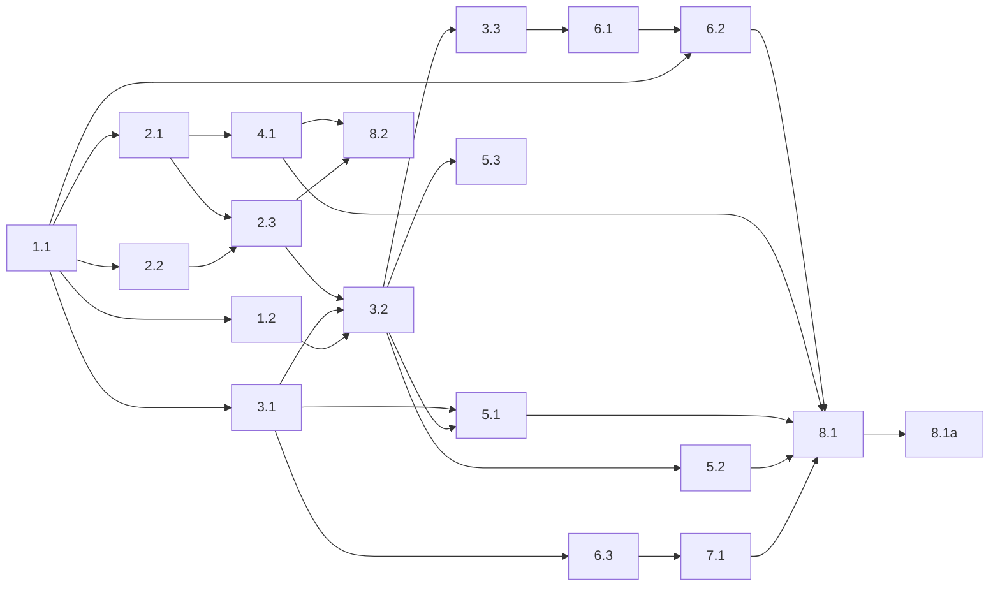

# Tasks: custom-harness

Flat checklist below; the mermaid graph at the end is the authoritative
sequencing/parallelism contract.

## 1. Foundation: dependencies

- [ ] 1.1 Resolve the BLOCKING `pydantic-ai-harness` ↔ `pydantic-ai==1.99.0` version conflict (harness latest needs `pydantic-ai-slim>=1.105.0`): either pin the harness to a 1.99-compatible release (reported v0.3.0) or bump `pydantic-ai>=1.105.0`, then `uv add` the chosen harness (code-mode/Monty extra) and `bashlex`; `genai-prices` already satisfies.
- [ ] 1.1a Verify: `uv lock` resolves with no version conflict, and a throwaway import of `pydantic_ai_harness` (`FileSystem`, `Shell`, `CodeMode`) + `bashlex` runs clean; capture output.
- [ ] 1.2 Implement the conflict-mode end-run helper (settled mechanism, design Decision 5 + API Reference): an `agent.iter()` driver that breaks when the git-transition tool sets `deps.transition_done`, reading `run.usage()` after the break, then lets the orchestrator start a fresh `agent.iter` with continuity notes.
- [ ] 1.2a Verify: a minimal script proves a tool flips the deps flag, the loop breaks before the next model request (no extra round-trip), `run.usage()` is readable post-break, and a fresh run starts; capture output.

## 2. In-process git mediation toolset

- [ ] 2.1 Implement the target-repo resolver as a standalone module imported by BOTH the in-process toolset and the backstop: from a command's cwd + `-C`/`--git-dir`/`--work-tree` (argv only), resolve `rev-parse --absolute-git-dir` against real git and compare to `workspace_dir/.git`; reject any invocation carrying a `GIT_*` env var (fail closed).
- [ ] 2.1a Verify: unit tests for workspace vs. temp-repo vs. `-C`/`--git-dir`-redirected commands, and `GIT_*`-present rejection; capture test output.
- [ ] 2.2 Implement bashlex command parsing: walk the AST, collect every git command node (across `&&`/`||`/`;`, pipelines, subshells, command substitution, env-prefix, redirects) and its argv; on parse failure during a paused rebase, raise `ModelRetry`; delegate unconditionally when no rebase is in progress.
- [ ] 2.2a Verify: unit tests over compound/obfuscated command strings and the paused-vs-not parse-failure behavior; capture test output.
- [ ] 2.3 Build the forklift git-mediation toolset as a `FunctionToolset` subclass passed via `Agent(toolsets=[...])` (NOT the stock `Shell` capability, which exposes all four tools unconditionally): expose only our `run_command`, hold a private `ShellToolset` instance and delegate non-git / non-workspace commands to its `run_command`; workspace-repo git → `classify_paused_rebase_command` + the in-process transition path that mutates the shared `AgentDeps` (design "Agent deps + loop/tool division of labor"); serialize rebase-state mutation behind `deps.lock` for `asyncio.gather` fan-out.
- [ ] 2.3a Verify: tests assert workspace rebase verbs mediate and set the right `AgentDeps` flags, temp-repo git delegates, background tools are absent, and concurrent `run_command` calls serialize the transition; capture test output.

## 3. In-process agent loop and lifecycle

- [ ] 3.1 Construct the Pydantic AI agent: wire `FileSystem` capability + our git-mediation toolset (via `toolsets=`) + `CodeMode`; do NOT add a separate tool-search package (`ToolSearch` is auto-injected by pydantic-ai 1.99.0); set model/provider from env (`FORKLIFT_MODEL`/`FORKLIFT_MODEL_EFFORT`; `GOOGLE_API_KEY`/`GEMINI_API_KEY` for Gemini, not `GOOGLE_GENERATIVE_AI_API_KEY`).
- [ ] 3.1b Author the conflict-resolution system prompt per design Decision 10: build on the existing FORK.md body / instructions payload / continuity notes, don't over-explain git rebasing, and explicitly state the inverted `theirs`(=fork) / `ours`(=upstream) semantics so the agent never resolves the wrong side.
- [ ] 3.1ba Verify: a fixture conflict where fork and upstream both changed a line resolves to the fork's intended side (theirs); capture test output.
- [ ] 3.1a Verify: agent constructs and completes a trivial run against the configured provider in a throwaway workspace; capture output.
- [ ] 3.2 Rebuild `orchestrate.py` as the in-process loop using the end-run helper (1.2): drive initial rebase, run the agent via `agent.iter()`, handle transitions in-process (record note, run frozen continue-check, advance); rebase-mode returns next-conflict state as the tool string (run continues), conflict-mode sets `deps.transition_done` → break → fresh session with continuity notes. Reuse `rebase_state.py`; fold `mediate.py:main()` into the toolset git branch.
- [ ] 3.2a Verify: tests drive multi-conflict rebase fixtures through both lifetime modes and assert resolution notes, continue-check gating, and single-conflict-per-session; capture test output.
- [ ] 3.3 Remove the intra-container control socket: delete `control.py` and the `TransitionReport`/`Directive` report-and-wait protocol and `FORKLIFT_REBASE_CONTROL_SOCK` plumbing; keep the host events socket intact.
- [ ] 3.3a Verify: grep confirms no remaining control-socket references; host events (`emit_event`) still fire in tests; capture output.

## 4. Backstop shim

- [ ] 4.1 Demote `docker/kitchen-sink/harness/includes/bin/git` to a thin bash shim that execs `/opt/forklift/venv/bin/python -m forklift_harness.backstop "$@"`, reusing the shared target-repo resolver module (2.1): reject `GIT_*`; allow workspace read-only (`ALLOWED_PAUSED_COMMANDS`) and git's own recursion, refuse workspace rebase-state mutators that bypassed the in-process path, `exec` real git for any other repo.
- [ ] 4.1a Verify: tests run nested workspace read-only, nested temp-repo mutating git, and a bypass mutator while the workspace rebase is paused; assert allow/allow/refuse; capture test output.

## 5. Telemetry: logging not parsing

- [ ] 5.1 Emit structlog events for agent steps, tool calls, and rebase transitions at their call sites under the existing `run=<id>` correlator.
- [ ] 5.1a Verify: a recorded run produces structured step/tool/transition events with zero `Unsupported paused rebase command shape` noise; capture log sample.
- [ ] 5.2 Replace metrics with exact cost: price the aggregated `result.usage` once via `genai_prices.calc_price(result.usage, FORKLIFT_MODEL)` (single model per run → exact); retire `src/forklift/post_run_metrics.py` and migrate the post-run summary to the usage source.
- [ ] 5.2a Verify: post-run summary tests assert token counts + `Decimal` cost from `result.usage`; old parser tests removed; capture test output.
- [ ] 5.3 Retire the client-log viewer entirely: delete `src/forklift/clientlog_renderer.py`, `src/forklift/clientlog_command.py` (the `forklift clientlog` command + its CLI registration), and the `opencode-client.log` file path; surface the agent step/tool/transition logs at the top-level `run=<id>` stream the operator sees live.
- [ ] 5.3a Verify: `forklift clientlog` is gone (CLI no longer registers it) and an end-to-end run shows agent step/tool/transition events inline at the top level; capture log sample.

## 6. Sandbox image and OpenCode removal

- [ ] 6.1 Delete `docker/kitchen-sink/opencode/`; move the entrypoint to `docker/kitchen-sink/harness/entrypoint.sh` (ownership restore + cleanup trap + `runuser` into `run.sh`), dropping the server boot (`start_server.sh`, server.ready/server.pid, health-gate, `/run/opencode`, `OPENCODE_SERVER_*`); `run.sh` launches `/opt/forklift/venv/bin/python -m forklift_harness.orchestrate`.
- [ ] 6.1a Verify: entrypoint launches the in-process harness with no server boot path; capture a dry-run/log.
- [ ] 6.2 Update the Dockerfile: remove the OpenCode install block + `OPENCODE_VERSION`/`OPENCODE_HOME` ENV/PATH + `opencode/*` COPYs; add a uv-built venv at `/opt/forklift/venv` (Python 3.13) installing a new `docker/kitchen-sink/harness/py/pyproject.toml` (`forklift_harness` + pinned `pydantic-ai`, `pydantic-ai-harness[code-mode]`, `bashlex`, `genai-prices`, `structlog`); set `ENTRYPOINT` to `/opt/forklift/harness/entrypoint.sh`; rebuild the image.
- [ ] 6.2a Verify: `docker build -t forklift/kitchen-sink:latest docker/kitchen-sink` succeeds, the image lacks OpenCode, and the venv imports `forklift_harness` + deps; capture build log.
- [ ] 6.3 Rename the host env loader `opencode_env.py` → `forklift_env.py` (config file `opencode.env` → `forklift.env`); drop `OPENCODE_VARIANT`/`OPENCODE_AGENT`/`OPENCODE_SERVER_PASSWORD`/`OPENCODE_API_KEY`/`GOOGLE_GENERATIVE_AI_API_KEY`; keep provider keys (`OPENAI_API_KEY`/`ANTHROPIC_API_KEY`/`OPENROUTER_API_KEY`/`GOOGLE_API_KEY`+`GEMINI_API_KEY`); rename `OPENCODE_TIMEOUT`→`FORKLIFT_AGENT_TIMEOUT` and drop `OPENCODE_SERVER_PORT`/`OPENCODE_BIN`; in `container_runner.py` update env passing + `SENSITIVE_ENV_KEYS`, `HARNESS_ENTRYPOINT`→`/opt/forklift/harness/entrypoint.sh`, and drop the opencode-logs mount + the `opencode_logs` `RunPaths` field.
- [ ] 6.3a Verify: env-loader tests cover the renamed file/keys, the dropped keys, and Gemini via `GOOGLE_API_KEY`; capture test output.

## 7. Model and config

- [ ] 7.1 Wire `FORKLIFT_MODEL` (Pydantic AI `provider:model` id) and `FORKLIFT_MODEL_EFFORT` (reasoning-effort knob → provider `model_settings`) from env into the agent; default `FORKLIFT_MODEL` to `openrouter:google/gemini-3.1-flash-lite-preview` (uses the already-defined `OPENROUTER_API_KEY`).
- [ ] 7.1a Verify: config load + model resolution + effort→model_settings mapping tested for `FORKLIFT_MODEL`/`FORKLIFT_MODEL_EFFORT` and the default; capture test output.

## 8. End-to-end verification

- [ ] 8.1 Run an end-to-end rebase against a recorded multi-conflict fixture through the rebuilt image.
- [ ] 8.1a (HUMAN_REQUIRED) Confirm the run completes with correct resolutions, resolution notes recorded, agent telemetry visible at the top level, and zero snapshot/`Unsupported paused rebase command shape` noise.
- [ ] 8.2 Add self-hosting coverage: nested git/rebases in temp repos invoked while the workspace rebase is paused must pass through unmediated; workspace mutators outside the vocabulary must be refused.
- [ ] 8.2a Verify: the self-hosting test suite passes; capture test output.

## Dependency graph

