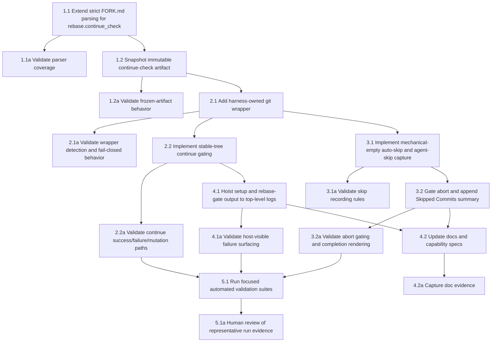

## 1. Front matter and frozen run contract
- [x] 1.1 Extend `docker/kitchen-sink/harness/includes/fork_context.sh:parse_fork_context()` for strict `rebase.continue_check` parsing and keep `src/forklift/changelog.py:load_changelog_exclude_patterns()` aligned with the updated unknown-key contract while preserving existing `setup` and `changelog` validation rules.
- [x] 1.1a Add/update parser tests covering valid inline and block-string `continue_check` values plus malformed `rebase` shapes and unknown-key failures.
- [x] 1.2 In `docker/kitchen-sink/harness/run.sh` and new `docker/kitchen-sink/harness/includes/rebase.sh`, snapshot the parsed `rebase.continue_check` into `/harness-state/rebase-continue-check.sh`, initialize `/harness-state/rebase-skipped-commits.json` to `[]`, resolve/export `REAL_GIT_BIN`, and prepend the wrapper directory to `PATH` before agent launch.
- [x] 1.2a Add harness tests proving the frozen continue-check artifact is the one executed even if the workspace copy of `FORK.md` changes mid-run.

## 2. Continue mediation
- [x] 2.1 Add `docker/kitchen-sink/harness/includes/bin/git` plus helper logic in `docker/kitchen-sink/harness/includes/rebase.sh` so paused-rebase `--continue`, `--skip`, and `--abort` are mediated, normal Git stays passthrough, and unknown paused-rebase invocation shapes fail closed.
- [x] 2.1a Add harness tests covering passthrough Git commands, guarded `rebase --continue` detection, and fail-closed behavior for unsupported paused-rebase command shapes.
- [x] 2.2 Implement `rebase --continue` gating in `rebase.sh` using pre/post `git status --porcelain=v1 --untracked-files=all` snapshots, full terminal failure output, and real `git rebase --continue` only after zero-exit stable-tree runs; if that real continue returns non-zero, the rebase is still paused, and the porcelain status is empty, auto-run the real `git rebase --skip` silently.
- [x] 2.2a Add harness/integration tests for continue-check success, non-zero failure, tracked mutation, untracked mutation, retry-after-fix behavior, and the empty-status auto-skip path after a failed real `git rebase --continue`.

## 3. Skip, abort, and completion reporting
- [x] 3.1 Implement agent-directed skip capture in `rebase.sh` using `REBASE_HEAD` SHA/subject before the real `git rebase --skip` executes, persisting only explicit agent skips to `/harness-state/rebase-skipped-commits.json`; leave mechanically empty auto-skips unrecorded because they are handled by task 2.2.
- [x] 3.1a Add harness tests proving mechanically empty auto-skips from the continue path are not recorded and explicit agent skips persist exact `REBASE_HEAD` identity in harness-owned metadata.
- [x] 3.2 Gate `git rebase --abort` on non-empty `workspace/STUCK.md` in `rebase.sh` and widen `Forklift._render_terminal_summary(...)` plus `render_completion_report(workspace, *, harness_state, console)` so host-side completion rendering always appends a host-generated `## Skipped Commits` section sourced from `/harness-state/rebase-skipped-commits.json`, using `None` when no agent-directed skips occurred.
- [x] 3.2a Add tests for abort rejection/allowance and completion-report rendering with both `Skipped Commits:\nNone` and populated skipped-commit lists.

## 4. Top-level logging and documentation
- [x] 4.1 Replace side-log-first setup diagnostics with phase-tagged top-level harness output in `docker/kitchen-sink/harness/includes/setup.sh` and `docker/kitchen-sink/harness/includes/rebase.sh`, preserving `opencode-client.log` as the separate deep transcript and using the current post-run `ContainerRunner.run(...)` stdout/stderr transport unless a separate streaming change is made.
- [x] 4.1a Add harness/CLI tests showing setup and rebase-gate failures appear in host-visible container stdout/stderr without requiring operators to open `setup.log` or any rebase-specific side log.
- [x] 4.2 Update `FORK.md`, `README.md`, and affected OpenSpec capability documents to describe `rebase.continue_check`, top-level failure surfacing, skipped-commit reporting, and the revised setup-log contract.
- [x] 4.2a Capture doc diffs or rendered excerpts proving the operator-facing docs and capability specs describe the new behavior consistently.

## 5. Focused validation
- [x] 5.1 Run the targeted parser, harness, and completion-report test suites touched by this feature, with `tests/test_harness_setup.py` covering parser/wrapper behavior and `tests/test_post_run_metrics.py` covering report augmentation, and archive the command outputs as implementation evidence.
- [ ] 5.1a (HUMAN_REQUIRED) Review a representative run transcript/log excerpt showing one continue-check retry, one automatic mechanical skip, one agent-directed skip in the final summary, and one abort rejected until `STUCK.md` exists.

